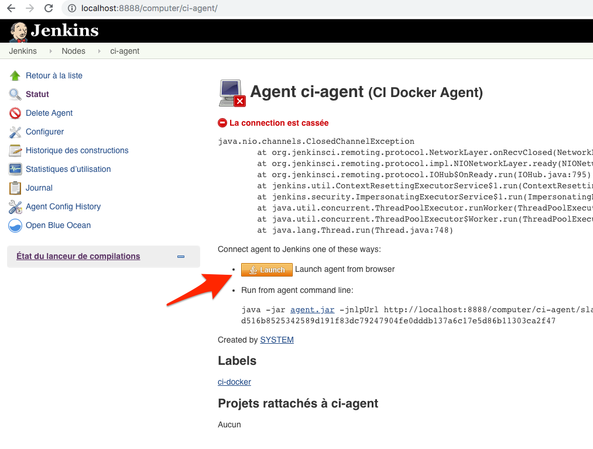
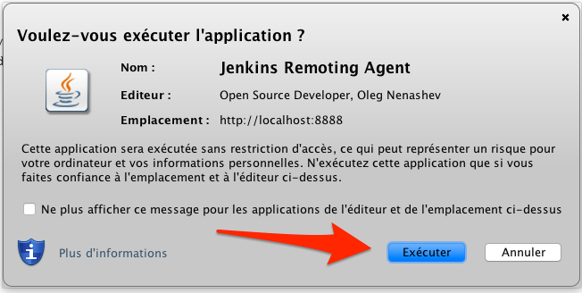
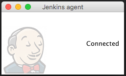
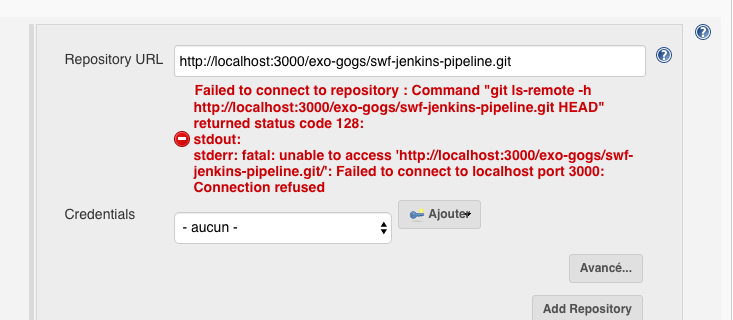

= Getting Started with eXo Jenkins2 Pipeline

== Build the eXo Jenkins Images

=== Base Image with plugins

.Create the base Jenkins CI image with all plugins
[source,shell]
----
$ docker build -t exoplatform/ci:jenkins-plugins jenkins2/plugins/
----

To install the last versions of the plugins you can execute the same command with an additional build arg :
----
$ docker build --build-arg LAST_PLUGINS_VERSION=true -t exoplatform/ci:jenkins-plugins jenkins2/plugins/
----

[NOTE]
--
This intermediate Docker image is created to be more efficient in development mode.
Indeed, the step where all Jenkins are downloaded is very slow and unstable.
--

=== eXo Jenkins Image

.Create the Jenkins CI Image with all Groovy scripts used to initialize the instance
[source,shell]
----
$ docker build -t exoplatform/ci:jenkins jenkins2/ --no-cache
----

== Launch Jenkins and Gogs

.Execute the following command to setup all required software
[source]
----
$ docker-compose up
----

=== Configure Gogs

. Go to http://localhost:3000/user/sign_up
.. Create a new account
... username: `exo-gogs`
... password: `exo-gogs`
.. Create a new repository
... name: `swf-jenkins-pipeline-libs`
.. Clone it locally and initialize it with eXo Pipeline libs repository
[source,shell]
----
$ git clone git@github.com:exoplatform/swf-jenkins-pipeline-libs.git && cd swf-jenkins-pipeline-libs
$ git remote add gogs http://localhost:3000/exo-gogs/swf-jenkins-pipeline-libs.git
$ git remote -vv
gogs	http://localhost:3000/exo-gogs/swf-jenkins-pipeline-libs.git (fetch)
gogs	http://localhost:3000/exo-gogs/swf-jenkins-pipeline-libs.git (push)
origin	git@github.com:exoplatform/swf-jenkins-pipeline-libs.git (fetch)
origin	git@github.com:exoplatform/swf-jenkins-pipeline-libs.git (push)
$ git checkout -b local
$ git push -u gogs local:master
$ git branch -vv
  * local  697501c [gogs/master] Display and Generate Maven HTML Tests Reports
    master 697501c [origin/master] Display and Generate Maven HTML Tests Reports
----
.. Create a new repository
... name: `swf-jenkins-pipeline`
.. Clone it locally and initialize it with eXo Pipeline repository
[source,shell]
----
$ git clone git@github.com:exoplatform/swf-jenkins-pipeline.git && cd swf-jenkins-pipeline
$ git remote add gogs http://localhost:3000/exo-gogs/swf-jenkins-pipeline.git
$ git remote -vv
gogs	http://localhost:3000/exo-gogs/swf-jenkins-pipeline.git (fetch)
gogs	http://localhost:3000/exo-gogs/swf-jenkins-pipeline.git (push)
origin	git@github.com:exoplatform/swf-jenkins-pipeline.git (fetch)
origin	git@github.com:exoplatform/swf-jenkins-pipeline.git (push)
$ git checkout -b local
$ git push -u gogs local:master
$ git branch -vv
  * local  697501c [gogs/master] Display and Generate Maven HTML Tests Reports
    master 697501c [origin/master] Display and Generate Maven HTML Tests Reports
----

=== Configure Jenkins

After the first startup of Jenkins container you will have to finish the install in your browser.

* Go to http://localhost:8888/ 
* fill the (generated) admin password which is available in jenkins startup log
* choose to select the Jenkins Plugins you want to install
* unselect ALL plugins from the plugin install selection screen

You should have a Jenkins agent already created but you need to start it

* go to http://localhost:8888/computer/ci-agent/
* download the JavaWebStart file

* start the agent with the following command (adapt the path to your download location)

[source,shell]
----
javaws ~/Download/slave-agent.jnlp
----

The jenkins agent is now up and running (keep open the tiny ugly window)

Congrats, You can execute Jenkins Pipeline with Docker!

http://localhost:8888/

=== Create a Seed Job

On the jenkins home page

- click on new item
- Enter the name of your project
- select free-style project and validate

On the job configuration

- on ``Source code management`` section
  1. Select Git
  1. Repository URL : ``http://localhost:3000/exo-gogs/swf-jenkins-pipeline.git``
  1. Branches to build ``*/master``

[NOTE]
====
Don't be surprised to see warning from jenkins for your url it will work ;-)
====

- Add a new build step on the *Build* section of type ``Process Job DSLs``
- Select `Use the provided DSL script option`
- Copy and paste you dsl script on the text area
- Set the values for the options :
  1. Action for removed jobs: *Delete*
  1. Action for removed views : *Delete*
  1. Action for removed config files :  *Ignore*
- Save

You are ready to test your job

